# ChatCenter Aiへようこそ！
こちらのドキュメントでは、ChatCenter Aiのご登録方法、ご利用開始方法から、詳細設定機能、APIを用いたカスタマイズ開発方法までをご説明いたします。

## 目次
* [1. ChatCenter Aiについて](#introduction)
  * [1-1. ユーザの種類](#type_of_users)
* [2. カスタマー向け機能](#for_customer)
  * [2-1. 会話ルームの発見](#locate_entrance)
  * [2-2. 認証](#authenticate_customer)
  * [2-3. ビジネスとの会話](#converse)
* [3. ビジネス向け機能](#for_business)
  * [3-1. 認証](#authenticate_business)
  * [3-2. 会話チャネル開設](#open_channel)
  * [3-3. 受信箱](#inbox)
  * [3-4. テンプレート](#template)
  * [3-5. 自動化ルール](#automation_rule)
  * [3-6. サジェスチョン](#suggestion)
  * [3-7. ファネル](#funnel)
  * [3-8. チーム管理](#manage_team)
  * [3-9. アカウント管理](#manage_account)
* [4. 次のステップ](#next_steps)


<a name="introduction"></a>
# 1. ChatCenter Aiについて
ChatCenter Aiは、デザインとデータのアプローチにより、企業とそのお客様であるカスタマーのコミュニケーションの効率化および自動化するためのプラットフォームです。


<a name="type_of_users"></a>
## 1-1. ユーザーの種類
ChatCenter Ai上には、次の4種類のユーザーが存在しています。

1. **カスタマー**: 貴社のお客様（エンドユーザー様）です。
2. **オペレーター**: 主に手動でカスタマーに回答するご担当者様です。
3. **スーパーバイザー**: 主にメンバーの管理、定型文や自動化ルールの管理、会話内容の監視等をするお問合わせ対応チームの管理者です。
4. **ビジネスオーナー**: お問合わせ対応チーム自体の管理、ChatCenter Aiアカウント自体の管理をするプライマリーアカウントです。チームの規模等によっては、スーパーバイザーと重複する場合もあります。

上記それぞれのユーザーの利用、作成、編集、削除の権限は次の通りです。

|   |   | カスタマー | オペレーター  | スーパーバイザー  | ビジネスオーナー  |
| :---  | :---  | :---  | :---  | :---  | :---  |
| カスタマー向け | 認証  | 利用可能  | - | - | - |
|   | ビジネスとの会話  | 利用可能  | - | - | - |
| ビジネス向け  | 認証  | - | 利用可能  | 利用可能  | 利用可能  |
|   | カスタマー向け会話チャネル開設 | - | 利用可能  | 利用可能  | 利用可能  |
|   | 受信箱 | - | 利用可能  | 利用可能  | 利用可能  |
|   | テンプレート  | - | 利用可能  | 利用、作成、編集、削除可能 | 利用、作成、編集、削除可能 |
|   | 自動化ルール  | - | 利用可能  | 利用、作成、編集、削除可能 | 利用、作成、編集、削除可能 |
|   | サジェスチョン | - | 利用可能  | 利用、作成、編集、削除可能 | 利用、作成、編集、削除可能 |
|   | チーム管理 | - | - | 管理可能  | 管理可能  |
|   | アカウント管理 | - | - | - | 管理可能  |


---
<a name="for_customer"></a>
# 2. カスタマー向け機能
ビジネスとして、あなたのチャットセンターを開設すると、あなたのビジネスのお客様であるカスタマーは、あなたのチャットセンターを介して、あなたとの会話を開始することができます。ここでは、あなたのカスタマーが会話ルームを発見し、認証をし、会話を開始するためのステップについてご紹介します。


<a name="locate_entrance"></a>
## 2-1. 会話ルームの発見
チャットセンターでは、カスタマーがあなたのビジネスと会話を始めるための複数の入口をご用意しております。詳細は、 [3-2. 会話チャネル開設](#open_channel)をご確認ください。


<a name="authenticate_customer"></a>
## 2-2. 認証
チャットセンターでは、カスタマーがあなたのビジネスと会話を始める際に、複数の認証方法を提供しています。

| 認証方法  | 概要  | 会話の継続方法 |
| :---  | :---  | :---  |
| 認証なし  | 認証をせずに会話を開始することができます。 | 認証なしの会話は、任意の時間アクティビティがない場合にセッションが破棄されます。セッションが破棄されるとカスタマーは同じ会話ルームに再入室することはできませんが、あなたは受信箱内で当該会話を閲覧することができます。 |
| SMS | 携帯電話の番号を入力することで、SMS経由でのワンタイムパスワードにより認証することができます。  | 任意の時間が経過するとセッションが破棄されますが、再び同じ携帯電話番号を用いて認証をすることで、カスタマーは同じ会話ルームに再入室することができます。 |
| メール | メールアドレスを入力することで、メールで送付されるのワンタイムパスワードにより認証することができます。 | 任意の時間が経過するとセッションが破棄されますが、再び同じメールアドレスを用いて認証をすることで、カスタマーは同じ会話ルームに再入室することができます。  |
| Facebook  | Facebookのアカウントを用いて認証をすることができます。 | 任意の時間が経過するとセッションが破棄されますが、再び同じFacebookのアカウントを用いて認証をすることで、カスタマーは同じ会話ルームに再入室することができます。 |
| Google  | Googleのアカウントを用いて認証をすることができます。 | 任意の時間が経過するとセッションが破棄されますが、再び同じGoogleのアカウントを用いて認証をすることで、カスタマーは同じ会話ルームに再入室することができます。 |
| Twitter | **公開前機能** - Twitterのアカウントを用いて認証をすることができます。  | 任意の時間が経過するとセッションが破棄されますが、再び同じTwitterのアカウントを用いて認証をすることで、カスタマーは同じ会話ルームに再入室することができます。  |
| LinkedIn  | **公開前機能** - LinkedInのアカウントを用いて認証をすることができます。 | 3任意の時間が経過するとセッションが破棄されますが、再び同じLinkedInのアカウントを用いて認証をすることで、カスタマーは同じ会話ルームに再入室することができます。  |


<a name="converse"></a>
## 2-3. ビジネスとの会話
認証が完了すると、カスタマーはビジネスとの会話を開始することができます。

1. 会話画面内上部に、あなたのビジネスの**ブランドバナー画像**、および、問い合わせ先の**チーム名**が表示されます。
2. **自動化ルール**が設定されている場合は、メッセージが届きます。
3. カスタマーは、メッセージに含まれる**期待する回答**から選択することで即座に回答をすることができます。
4. カスタマーは、画面最下部の**ウィジェット選択部**から、自由なメッセージを編集して送信することができます。このイメージ内には、「文字入力」「場所選択」「日時選択」によるメッセージの編集および送信機能が表示されています。カスタマーが利用可能な**ウィジェット**は、スーパーバイザーにより設定変更することができます。
5. 右上のXボタンをクリックすることで、会話からログアウトすることができます。
  * **認証なし**で会話を開始している場合は、セッションが破棄され、カスタマーは同じ会話ルームに再入室することはできませんが、オペレーターは**受信箱**内で当該会話を閲覧することはできます。
  * **認証済み**で会話を開始している場合には、セッションが破棄されますが、再び同じアカウントを用いて認証をすることで、カスタマーは同じ会話ルームに再入室することができます。

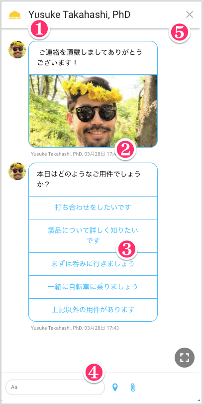


---
<a name="for_business"></a>
# 3. ビジネス向け機能
ビジネスとして、あなたのチャットセンターを開設すると、あなたのチャットセンターに関わるオペレーター、スーパーバイザー、ビジネスオーナーは、チャットセンターを運用し、管理することができます。

具体的には次のそれぞれの機能をご利用いただくことができます。

* [3-1. 認証](#authenticate_business)
* [3-2. 会話チャネル開設](#open_channel)
* [3-3. 受信箱](#inbox)
* [3-4. テンプレート](#template)
* [3-5. 自動化ルール](#automation_rule)
* [3-6. サジェスチョン](#suggestion)
* [3-7. チーム管理](#manage_team)
* [3-8. アカウント管理](#manage_account)


<a name="authenticate_business"></a>
## 3-1. 認証（サインアップおよびサインイン）
チャットセンターでは、オペレーター、スーパーバイザー、ビジネスオーナーがチャットセンターをご利用するためのサインアップおよびサインインの方法を複数提供しています。

| 認証方法  | 概要  |
| :---  | :---  |
| SMS | 携帯電話の番号を入力することで、SMS経由でのワンタイムパスワードによりサインインすることができます。 |
| メール | メールアドレスを用いてユーザ登録をすることで、メールアドレスおよびパスワードによりサインインすることができます。  |
| Facebook  | Facebookのアカウントを用いてサインインをすることができます。  |
| Google  | Googleのアカウントを用いてサインインをすることができます。  |
| LinkedIn  | **非公開機能** - LinkedInのアカウントを用いてサインインをすることができます。  |


<a name="open_channel"></a>
## 3-2. カスタマー向け会話チャネル開設
チャットセンターでは、カスタマーがあなたのビジネスと会話を始めるための複数の入口をご用意しております。

| 会話開始場所  | 概要  |
| :---  | :---  |
| URL | チャットセンターから提供されるURLを開くことで、会話ルームに即座に入室することができます。開いたウェブサイトは会話開始後はカスタマー専用のチャットルームとなるため、「ホームボタンに追加」等をしてブックマークすることで会話を継続することができます。  |
| QRコード | チャットセンターから提供されるQRコードを読み込むことで、URLを開き、会話ルームに入室することができます。  |
| 貴社のウェブサイト | チャットセンターから提供される埋め込みコードを貴社ビジネスのウェブサイトに埋め込んでいただくことで、貴社ビジネスのウェブサイト上に表示される**会話開始ボタン**から会話ルームに入室することができます。 |
| 貴社のスマートフォン・アプリケーション | チャットセンターから提供される埋め込みコードを貴社ビジネスのiOSもしくはAndroidアプリケーションのプロジェクトに埋め込んでいただくことで、貴社ビジネスのスマートフォン・アプリケーション上に表示される**会話開始ボタン**等から会話ルームに入室することができます。 |
| SMS | **非公開機能** - チャットセンターから購入できる電話番号もしくは貴社保有の電話番号をカスタマーからの問い合わせ入り口として設定することができます。この機能は現在非公開です。ご利用をご希望される場合はお問い合わせください。 |
| Email | **非公開機能** - 貴社保有のメールアドレスをカスタマーからの問い合わせ入り口として設定することができます。この機能は現在非公開です。ご利用をご希望される場合はお問い合わせください。 |
| Facebook Messenger  | **非公開機能** - 貴社保有のFacebookビジネスのアカウントをカスタマーからの問い合わせ入り口として設定することができます。この機能は現在非公開です。ご利用をご希望される場合はお問い合わせください。  |
| LINE  | **非公開機能** - 貴社保有のLINEビジネスのアカウントをカスタマーからの問い合わせ入り口として設定することができます。この機能は現在非公開です。ご利用をご希望される場合はお問い合わせください。  |


<a name="inbox"></a>
## 3-3. 受信箱
画面最下部の左側のタブから開くことができる**受信箱**は、カスタマーとのメッセージの送受信をし、カスタマーと会話ルームに関する情報について確認し、管理するための場所です。左から3つの画面により構成しています。

1. 会話リスト
2. 会話内容
3. 会話とカスタマーに関する詳細（右メニュー）

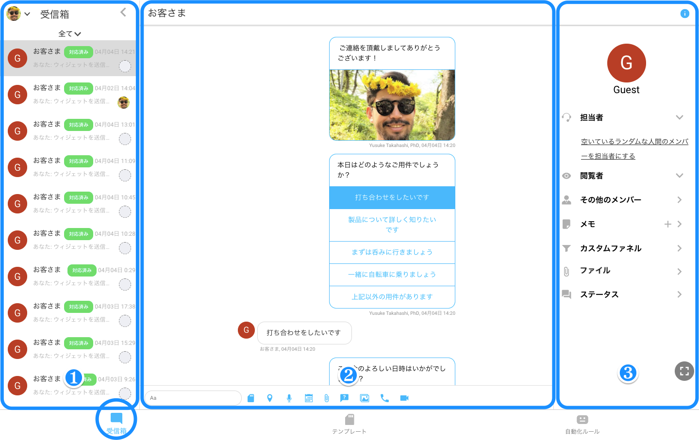

### 3-3-1. 会話リスト
受信箱の左手には、**会話リスト**が表示されます。ここでは、会話一覧と、それぞれの会話に関する概要を確認することができます。

また、会話の表示することで、未対応・対応済を確認することができます。


### 3-3-2. 会話内容
受信箱の中央には、会話リストで選択された**会話内容**が表示されます。ここでは、

### 3-3-3. 会話内容とカスタマーに関する詳細（右メニュー）
受信箱の右手には、会話リストで選択された**会話内容とカスタマーに関する詳細**が表示されます。通称**右メニュー**と呼んでいます。ここでは、


<a name="template"></a>
## 3-4. テンプレート
**テンプレート**は、あらかじめ作成しておく定型文のことで、テキストのみの定型文や、選択肢つきの質問文などがあります。**自動化ルール**で自動送信されるメッセージは「テンプレート」を用います。

### 3-4-1. テンプレートの登録方法
本文、アタッチメント、期待する解答候補を選択することでひとつのメッセージを作成することが出来ます。(テンプレートは、自動化ルールの「Action（アクション）」で使用することができます。)

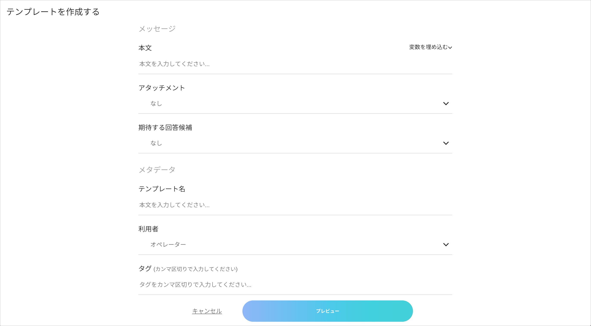


### 3-4-2. アタッチメント

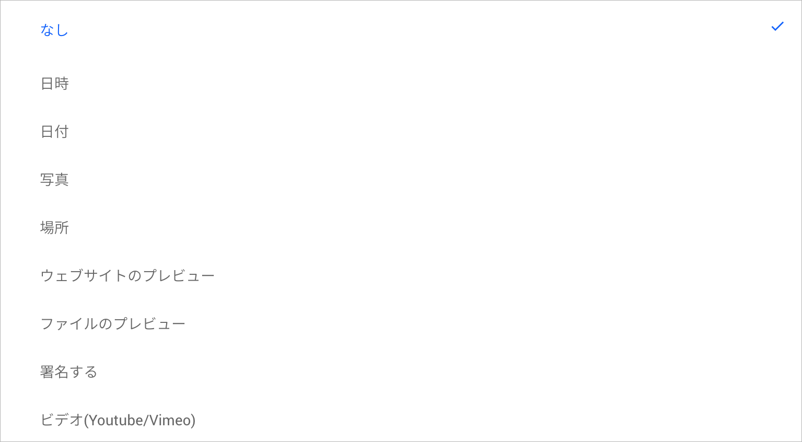

|  項目  |   概要   |
|:---|:---|
|  日時  |  指定日時を1つ選択する。 |
|  日付  |  指定の日付を1つ選択する。 |
|  写真   |  写真を1つ選択する。 |
|  場所 |  地図で指定した場所を1つ選択する。 |
|  ウェブサイトのプレビュー  |  ウェブサイトのプレビューを1つ選択する。 |
|  ファイルのプレビュー  |  ファイルを1つ選択する。 |
|  署名する  |  署名を送る。 |
|  ビデオ（Youtube/Vimeo） |  ビデオ（Youtube/Vimeo）を送る。 |


### 3-4-3. 期待する回答候補

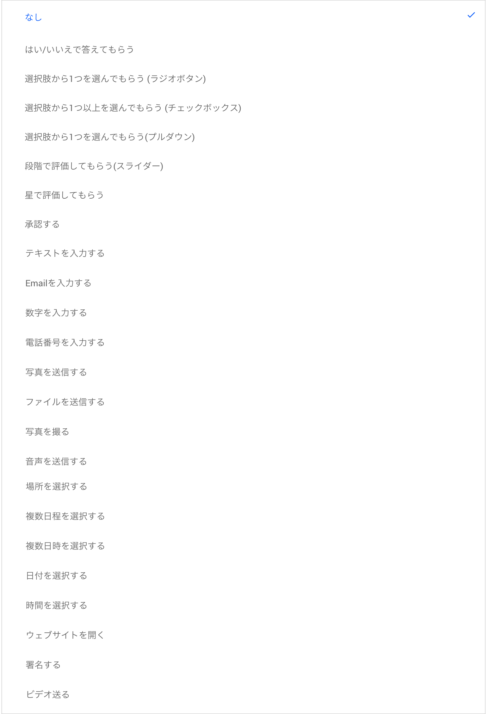

|  項目  |   概要   |
|:---|:---|
|  はい/いいえで答えてもらう  |  絵文字orテキストで、イエス/ノーの選択肢を作成する。 |
|  選択肢で１つを選んでもらう(ラジオボタン)  |  回答候補の中から１つ選んでもらう選択肢を作成する。 |
|  選択肢で１つ以上を選んでもらう(チェックボックス)  |  回答候補の中から複数選択してもらう選択肢を作成する。 |
|  選択肢で１つを選んでもらう(プルダウン) |  プルダウン形式の選択肢を作成する。 |
|  段階で評価してもらう(スライダー)  |  こちらで指定した数字の段階評価から１つ選ぶ形式の選択肢を作成する。 |
|  星で評価してもらう  |  最小3~最大5個の星で評価を選ぶ形式の選択肢を作成する。 |
|  承認する  |  絵文字、OK、承認しましたの中から1つ選んで承認するボタンを作成する。 |
|  テキストを入力する |  テキスト入力欄を作成する。 |
|  Emailで入力する  |  Email入力欄を作成する。|
|  数字を入力する |  数字を入力する欄を作成する。 |
|  電話番号を入力する  |  電話番号を入力する欄を作成する。 |
|  写真を送信する |  写真を選択し送信してもらうボタンを作成する。 |
|  ファイルを送信する  |  ファイルを選択し送信してもらうボタンを作成する。 |
|  写真を撮る  |  写真を選択し送信してもらうボタンを作成する。 |
|  音声を送信する  |  あらかじめ録音した音声を送信してもらうボタンを作成する。 |
|  場所を選択する |  場所を選択して送信してもらうボタンを作成する。 |
|  複数日程を選択する  |  複数の日程を選択して送信してもらうボタンを作成する。 |
|  複数日時を選択する  |  複数の日時を選択して送信してもらうボタンを作成する。 |
|  日付を選択する |  日付を1つ選択して送信してもらうボタンを作成する。 |
|  時間を選択する |  時間を1つ選択して送信してもらうボタンを作成する。 |
|  ウェブサイトを開く |  ウェブサイトを選択してもらうボタンを作成する。 |
|  署名する  |  署名を書き送信してもらうボタンを作成する。 |
|  ビデオを送る  |  ビデオを選択し送信してもらうボタンを作成する。 |


<a name="automation_rule"></a>
## 3-5. 自動化ルール
ChatCenter Aiでは、「自動化ルール」を設定することにより、あらかじめ定めたルールによって自動でメッセージを送信することができます。

|  項目  |   概要   |  例  |
|:---|:---|:---|
|  Event（イベント）   |  自動化ルールが発動されるタイミングを指定することができます。   |  "オペレータにメッセージが届いた際に"  |
|  Condition（付帯状況）   |   Eventが発生した際に、Actionを発動させる条件を指定することができます。  |  "18:00～翌7:00の間にメッセージが届いたら"  |
|  Action（命令）   |   特定のCondtionでEventが発生した際に実行する命令を指定ことができます。  |  "「時間外です」というメッセージをテンプレートから送信する" |

上記の項目を順番に設定していくことで、一つの自動化ルールが完成します。実運用上は、これらの自動化ルールをいくつも組み合わせていくことで、「botによる会話」のように自動対応したり、問い合わせの種類を分類するなどの対応を行ったりできます

### 関数と演算子
ChatCenter Aiの自動化ルールでは、以下の関数や演算子を用いて、自動化ルールを柔軟に構成することができます。

#### 条件式
以下の句を用いて、自動化ルールの基本的な条件式を指定できます。

|  項目  |   概要   |
|:---|:---|
|  ON   |  Eventを指定します。   |
|  IF   |   Conditionを指定します。   |
|  DO   |   Actionを指定します。   |

条件式は、以下の句を用いて制御できます。

|  項目  |   概要   |   利用可能箇所   |
|:---|:---|:---|
|  AND   |   複数のEvent、Condition、Actionを一つの条件式内に指定する際に使用します。すべてを同時に評価します。   |  ON, IF, DO   |
|  OR   |   複数のEvent、Condition、Actionを一つの条件式内に指定する際に使用します。2つのEventもしくはConditionのうち、どちらか一方が真の場合にActionを実行します。  |  ON, IF   |
|  XOR   |   複数のEvent、Condition、Actionを一つの条件式内に指定する際に使用します。2つのEventもしくはConditionどちらも偽の場合にActionを実行します。    |  ON, IF   |
|  THEN   |   複数のEvent、Condition、Actionを一つの条件式内に指定する際に使用します。指定された順番ですべてのActionを実行します。   |  DO   |
|  ALWAYS   |   Conditionがない場合に指定します。   |  -   |
|  ELIF   |   複数のConditionを一つの条件式内に指定する際に使用します。必ずIFの後で使用します。2回以上利用可能です。   |  IF   |
|  ELSE   |   一つ以上のConditionを用いた条件式内で、その条件に該当しない場合を指定する際に使用します。必ずIFかELIFの後で使用します。   |  IF   |

以下のような、条件式を指定することができます。

```sql
-- Pattern-1
ON <event>
IF <condition1> DO <action1> AND DO <action2> AND DO <action3>
ELSE <condition2> DO <action4> AND DO <action5> AND DO <action6>

-- Pattern-2
ON <event>
IF <condition1> DO <action1> THEN DO <action2> THEN DO <action3>
ELSE <condition2> DO <action4> THEN DO <action5> THEN DO <action6>

-- Pattern-3
ON <event>
IF <condition1> DO <action1> AND DO <action2> AND DO <action3>
ELSE <condition2> DO <action4> THEN DO <action5> THEN DO <action6>

-- Pattern-4
ON <event>
IF <condition1> DO <action1> THEN DO <action2> THEN DO <action3>
ELSE <condition2> DO <action4> AND DO <action5> AND DO <action6>

-- Pattern-5
ON <event>
IF <condition1> DO <action1> AND DO <action2> AND DO <action3>
ELIF <condition2> DO <action4> AND DO <action5> AND DO <action6>
ELSE DO <action7> AND DO <action8> AND DO <action9>

-- Pattern-6
ON <event>
IF <condition1> DO <action1> THEN <action2> THEN <action3>
ELIF <condition2> DO <action4> THEN <action5> THEN <action6>
ELSE DO <action7> THEN DO <action8> THEN DO <action9>

-- Pattern-7
ON <event>
IF <condition1> DO <action1> AND DO <action2> AND DO <action3>
ELIF <condition2> DO <action4> THEN DO <action5> THEN DO <action6>
ELSE DO <action7> AND DO <action8> AND DO <action9>

-- Pattern-8
ON <event>
IF <condition1> DO <action1> THEN <action2> THEN <action3>
ELIF <condition2> DO <action4> AND <action5> AND <action6>
ELSE DO <action7> THEN DO <action8> THEN DO <action9>
```

ただし、以下のような条件式を指定することはできません。

```sql
-- Pattern-9
ON <event>
IF <condition1> DO <action1> AND <action2> THEN <action3>
ELIF <condition2> DO <action4> THEN <action5> AND <action6>
ELSE DO <action7> THEN DO <action8> THEN DO <action9>
```

<!-- 例えば、Condition（付帯状況）を次のように複数指定することができます。
"**「夜中」かつ「特定のメッセージ」を送ってきたら**"  や、
"**「（顧客ファネルが）回答待ち」かつ「まだ回答は来ないですか？」というメッセージを送ってきたら**" といった条件も設定が可能です。-->

#### 比較演算子 (**非公開機能**)
通常の比較演算子が使用できます。

|  項目  |   概要   |
|:---|:---|
|  ==   |   等しい   |
|  !=   |   等しくない   |
|  >   |   小なり   |
|  <   |   大なり   |
|  <=   |   等しいかそれ以下   |
|  >=   |   等しいかそれ以上   |

<!--
#### 比較演算子
通常の比較演算子が使用できます。

|  項目  |   概要   |
|  THEN   |   できます。   |
-->

#### 算術演算子 (**非公開機能**)
以下の算術演算子が使用できます。

|  項目  |   概要   |
|:---|:---|
|  +   |   和   |
|  -   |   差   |
|  *   |   積   |
|  /   |   商（整数の割り算では余りを切り捨て）   |

<!-- 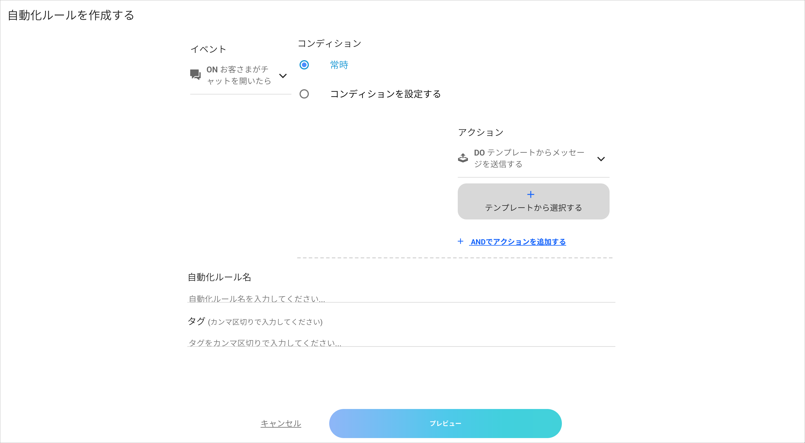 -->

### 3-5-1. 自動化ルールのEvent（タイミング）を設定

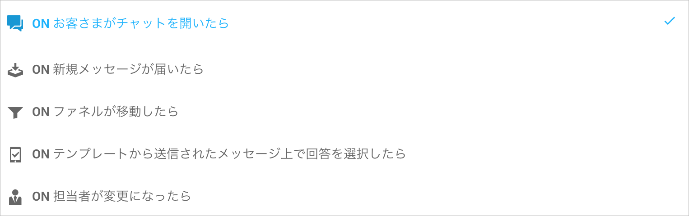


|  項目  |   概要   |  例  |
|:---|:---|:---|
|  お客様がチャットを開いたら   |  お客様が初めてチャットルームに入室した時   |  "お問い合わせ対応というシチュエーションで自動で「お問い合わせ有難うございます」と応答させる。"  |
|  新着メッセージが届いたら   |  お客様もしくはオペレーターが何かしらのメッセージを送信した時   |  "19時以降のメッセージには「申し訳ございません。対応時間外です」と応答させる。"  |
|  ファネルが移動したら   |  お客様を管理するファネル（ステータス）が移動したら  |  "オペレータが手動で「対応中」から「対応終了」に変更された際、「ご質問ありがとうございました」と自動で応答させる。" |
|  テンプレートから送信されたメッセージ上で回答を選択したら   |  お客様を管理するファネル（ステータス）が移動したら  |  "オペレータが手動で「対応中」から「対応終了」に変更された際、「ご質問ありがとうございました」と自動で応答させる。" |
|  担当者が変更になったら   |  担当者が変更になった時  |  担当者が変更になったら、「~担当の○○です。ご用件をお伺いいたします。」と自動で応答させる |
| 会話ステータスが変更されたら  | 会話ステータスが変更された時  | 会話ステータスが「会話終了済み」に変更されたら、担当者を外す  |
| チームとしての対応可能状態に変更があったら | メンバーのキャパシティに変更があったら | チームとしての対応可能状態に変更があったら、対応を待っているお客様に担当者をつける |
| アラームで一定時間が経過したら |   |   |


### 3-5-2. アクションを実行するCondition（実行条件）を設定

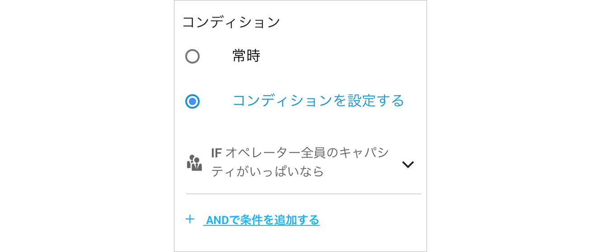

|  項目  |   概要   |
|:---|:---|
|  常時   |  常時自動化ルールを発動させる。NOTは利用不可  |
|  メッセージの送信者が次の人からなら  | オペレーターからメッセージが送信されたら、もしくは、お客さまからメッセージが送信された場合、自動化ルールを発動させる。 |
| メッセージが送信されていなかったら | メッセージが送信されていない場合、自動化ルールを発動させる。  | 
| メッセージに次の文字列が含まれていたら | 送信されたメッセージの本文内に指定した文字列が含まれていた場合に自動化ルールを発動させる。 | 
| 次のテンプレートからメッセージが送信されたら  | テンプレート内の選択肢が選択された場合、自動化ルールを発動させる。 | 
| メッセージに返信がされていなければ | 期待する回答が含まれるメッセージに返信がされていない場合、自動化ルールを発動させる。  | 
| ~が担当者なら | 特定の担当者の場合、自動化ルールを発動させる。 | 
| ファネルが~になったら | 特定のファネルの場合、自動化ルールを発動させる。  | 
| チームメンバー全員のキャパシティがいっぱいなら | チームメンバー全員のキャパシティがいっぱいになった場合、自動化ルールを発動させる。 | 
| 一定時間が経過したら  | 一定時間が経過したら、自動化ルールを発動させる。一定時間は秒数で指定する。 | 
| 会話ステータスが変化したら | 会話ステータスが会話終了済みもしくは、削除済みの場合、自動化ルールを発動させる。  | 
| チームが営業時間内なら | チームが営業時間内の場合、自動化ルールを発動させる。  | 
| 1人以上のオペレーターの対応可能人数に空きがあれば | 1人以上のオペレーターの対応可能人数に空きがある場合、自動化ルールを発動させる。  | 
| チームの対応可能人数に空きがあれば | チームの対応可能人数に空きがある場合、自動化ルールを発動させる。  | 
| スーパーバイザーが対応可能なら | スーパーバイザーが対応可能である場合、自動化ルールを発動させる。  | 
| スーパーバイザーがオンラインなら  | スーパーバイザーがオンラインである場合、自動化ルールを発動させる。 | 
| 1人以上のオペレーターがオンラインなら | 1人以上のオペレーターがオンラインである場合、自動化ルールを発動させる。  | 
| 1人以上のオペレーターが対応可能なら  | 1人以上のオペレーターが対応可能である場合、自動化ルールを発動させる。 | 


### 3-5-3. 実行するAction(アクション)を設定

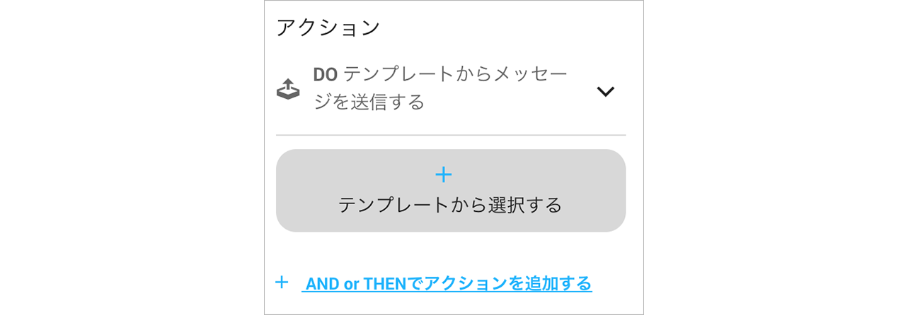

|  項目  |   概要   |
|:---|:---|
|  テンプレートからメッセージを送信する  |  任意のテキストメッセージ、または、あらかじめ作成した「テンプレート」を送信する。  |
|  通知する  |  通知を行う。 |
|  担当者にする   |  対応すべき担当者を設定する。 |
|  ファネルを次のように移動する |  質問者のファネルを移動させる。 |
|  会話ステータスを変更する |  会話ステータスを変更させる |
 


<a name="suggestion"></a>
## 3-6. サジェスチョン
**詳細は現在作成中です。**


<a name="funnel"></a>
## 3-7. ファネル
ChatCenter Aiには、ゲストの状態を管理する「ファネル」機能が備わっています。ファネルを活用することで、キャンペーン等を作成し、コンバージョンの計測が可能になります。

①ダッシュボードのファネルから入った画面の、右上のプラスアイコンをクリックします。

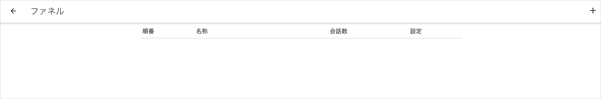

②順番と名称を設定します。ファネルの入口は1と設定し、ファネルの出口は一番大きい値を設定します。

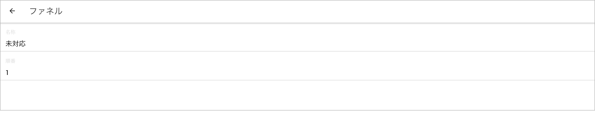

③作成完了。


### ファネルの更新方法
ファネルの変更方法は2種類あります。

* 受信箱の中にいるファネルを設定したいゲスト画面の右上にある「"ｉ"」ボタンを押下して**右メニュー**を開き、ファネルのセクションから設定したい項目を設定する。
* 自動化ルールから自動で設定する

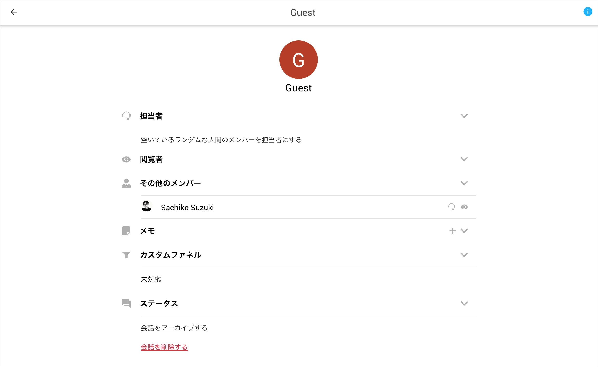


<a name="manage_team"></a>
## 3-8. チーム管理
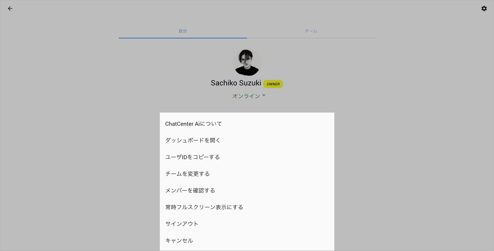

左メニュー画面右上の歯車のマークをクリックすると、メニューが表示されます。

|  項目  |   概要   |
|:---|:---|
|  ダッシュボードを開く  |  ダッシュボード画面の設定。 |
|  ユーザーIDをコピーする  |  自分のIDをコピー。 |
|  チームを変更する  |  参加しているチームの切り替え。 |
|  メンバーを見る |  それぞれのチームのメンバーを確認。 |
|  フルスクリーン表示にする  |  フルスクリーン表示に切り替え。 |
|  サインアウト  |  サインアウト  |
| キャンセル | 1つ前の画面に戻る |

### 3-8-1. ダッシュボードを開く

ダッシュボードでは、チーム全体に関わる設定をすることができます。下記の項目を順番に見ていきます。

#### 3-8-1-1. 会話
会話では、お客さまと会話を行う際に必要な設定を行えます。

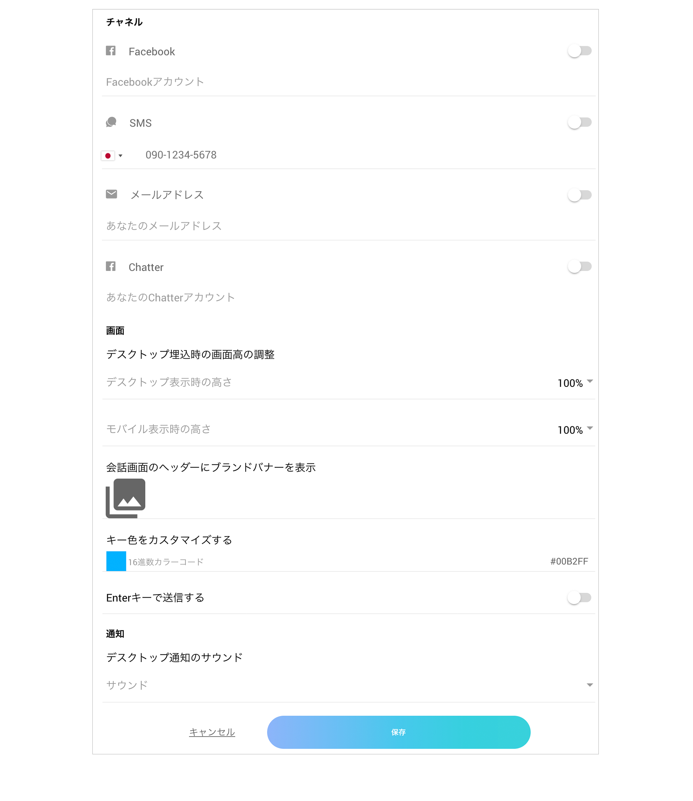

|  項目  |   概要   |
|:---|:---|
|  チャネル  |  Facebook、SMS、メールアドレス、Chatterアカウントのチャネル設定。 |
|  デスクトップ埋込時の画面高の調整  |  デスクトップ埋込時、モバイルでの画面高の調整。 |
|  会話画面のヘッダーにブランドバナーを設置  |  会話画面の左上に任意のブランドバナーの設置。 |
|  キー色をカスタマイズする | チャットで使われているキーカラーを指定したカラーに変更。 |
|  Enterキーで送信する  |  テキスト送信フォーム内において、Enterキーでの送信するorしない設定。 |
|  通知  |  受信時のサウンド設定。  |

#### 3-8-1-2. ウィジェット
ウィジェット機能をメッセージ入力画面での表示、非表示の設定ができます。お客さま側、オペレーター側で設定でき、お客さま側は人形アイコン、オペレーター側はネクタイありの人形アイコンで設定できます。

オペレーター側で全てオンにすると、下記のように表示されます。

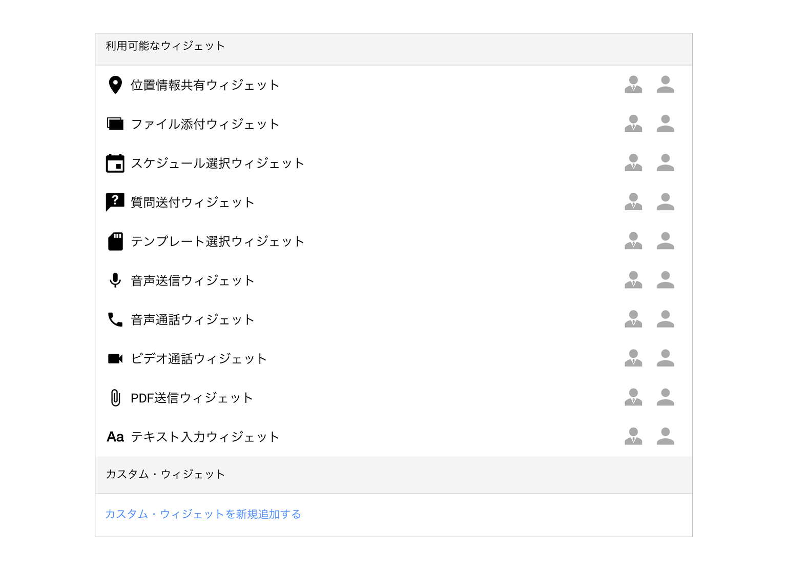


#### 3-8-1-3. サジェスチョン
会話内でのサジェスチョンのアクティブ切り替えを設定することが出来ます。


#### 3-8-1-4. チーム
チームに関する設定が行えます。

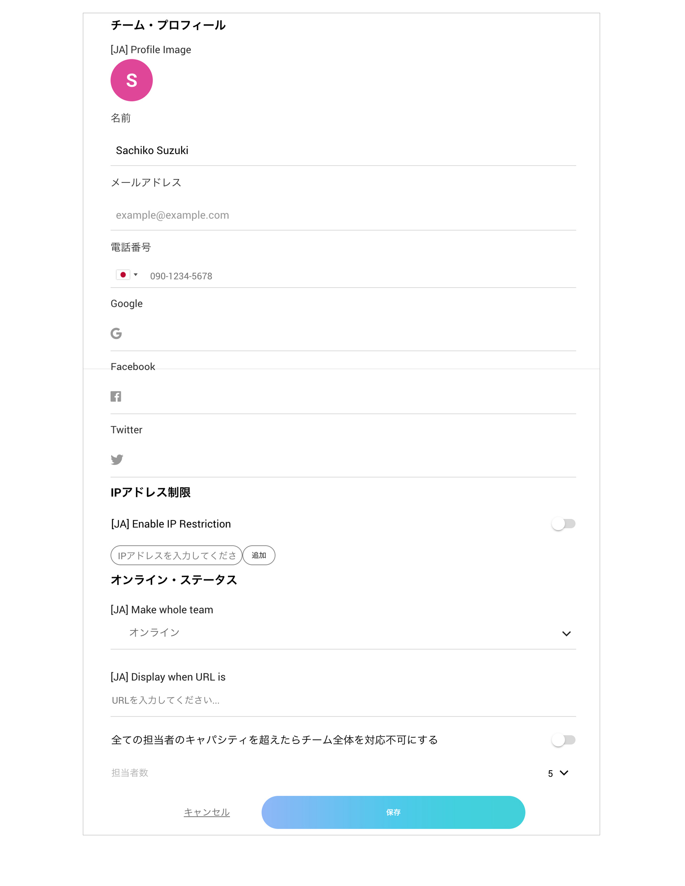

|  項目  |   概要   |
|:---|:---|
|  名前 | チームの名前を入力する。担当者が設定されていない場合、自動で送られるメッセージの送信者はチーム名になる。  |
|  メールアドレス  | チームのメールアドレスを入力する。設定をするとメッセージ到着時に通知がくる。  |
|  電話番号 | 電話番号を設定します。 |
|  Google | Googleのアカウントを設定します。 |
|  Facebook | Facebookのアカウントを設定します。 |
|  Twitter  | Twitterのアカウントを設定します。  |
|  IPアドレス制限 | 制限したいIPアドレスを追加します。  |
|  URLが合致する時のみ、チャット開始ボタンを表示する | 指定のURLのみチャットボタンを表示させます。 |
|  チーム全体をオフラインにする | チーム全体をオフラインにします。  |
|  以下の時間帯にチームを対応不可にする | 営業終了時間と営業開始時間を入力します。  |
|  チームの対応可能人数 | チームの対応可能人数を設定します。 |
|  オペレーター毎の対応可能人数 | オペレーター毎の対応可能人数を設定します。 |
|  チームアドミンの対応可能人数 | チームアドミンの対応可能人数を設定します。 |
|  同時オンライン顧客数が以下を超えたら、チームを対応不可にする | 同時にオンラインの顧客数が一定以上超えたら、チームを対応不可にします。 |

#### 3-8-1-5. ファネル
ChatCenter Aiには、ゲストの状態を管理する「ファネル」機能が備わっています。ファネルを活用することで、キャンペーン等を作成し、コンバージョンの計測が可能になります。

1. ダッシュボードを開くをクリックし、ファネル→右上のプラスアイコンをクリックします。
2. 順番と名称を設定します。ファネルの入口は1と設定し、ファネルの出口は一番大きい値を設定します。

ファネルの変更方法は2種類あります。
* 右メニューから手動で設定する
* 自動化ルールから自動で設定する

右メニューから手動で設定する方法は次のとおりです。

1. 受信箱をクリックする
2. 右上にある「i」のアイコンをクリックする
3. 設定したいファネルをクリックする

自動化ルールから自動で設定する方法は次のとおりです。例として、OKというボタンが押されたら、ファネルを予約に移動させるという自動化を作成いたします。

1. 自動化から右上にある+ボタンを押し、新規作成で自動化を作成する
2. イベントで、「テンプレートから送信されたメッセージ上で回答を選択したら」選択する
3. コンディションで「お客さまがテンプレートから送信されたメッセージ上で回答を選択したら」を選択する
4. アクションで「ファネルを次のように移動する」を選択した後、任意のファネルを設定。

#### 3-8-1-6 セキュリティとオーディット

セキュリティとオーディットでは、お客様側の会話の履歴を一定時間で、自動的に削除する設定ができます。


### 3-8-2. ユーザーIDをコピーする
お問い合わせ時にユーザーIDが必要となるケースがあります。


### 3-8-3. チームを変更する

#### 3-8-3-1. チームの考え方
自分の受信箱に他のアカウントを招待したい場合、チームを作成します。チームを持つには、自分のアカウントにメンバーを追加します。メンバーの追加方法は**メンバーを確認するで説明します。**
追加されたメンバーは、チームを変更することで、そのチームに参加できます。他のチームに移動するためにチームの変更方法をご紹介します。

#### 3-8-3-2 チームの変更方法
1.チームを変更するをクリック
2.変更したい自分以外のチームを選択(他のチームに参加していない場合は自分のチームのみ表示されます。)

*「黄色の管理者、メンバー」は自分がどの立場でメンバーに所属しているかを表しています。

### 3-8-4. メンバーを確認する
メンバーを確認するでは、メンバーを確認する他、メンバーを追加することができます。

#### 3-6-4-1 メンバーを追加する方法は次の2つです。
* メールで招待
* リンクで招待する

メールで招待する方法は、次のとおりです。

1. 右上にあるプラスのボタンを押す
2. メールで招待の「メールアドレスを入力してください」の箇所に招待した人のメールを貼り付け、追加するを押す。
3. 招待した人には、ログイン用のURLが添付されたメールが送られます。
4. すでにアカウントをお持ちの方を招待した場合、ログイン、アカウントをお持ちでない場合は、サインインをしてもらいます。

リンクで招待するは、次のとおりです。

1. 右上にあるプラスのボタンを押す
2. リンクで招待するに記載されているリンクを招待したメンバーに伝える

#### 3-8-4-2メンバーを削除する方法
チームメンバーが表示される一覧画面から削除したいメンバーの横にある×ボタンをクリックします。

### 3-8-5. 常時フルスクリーン表示する
お客様に対して、常時フルスクリーンでチャットセンターを使用する際、設定できます。

### 3-8-6. サインアウトする
対応が完了したらサインアウトをします。

### 3-8-7. キャンセル
キャンセルを押すと1つ前の画面に戻ります。


<a name="manage_account"></a>
## 3-9. アカウント設定

### 3-9-1. 自分
この画面では、オンラインステータスとプロフィールを設定できます。

#### 3-9-1-1. オンラインステータスの設定
オンラインステータスをオンライン、オフラインから選択します。オンラインは対応可能、オフラインは対応不可の際に使用します。

#### 3-9-1-2. プロフィールを編集する

|  項目  |   概要   |
|:---|:---|
| 名前  | チームの名前を入力する。担当者が設定されていない場合、自動で送られるメッセージの送信者はチーム名になる。  |
| 電話番号  | 電話番号を設定します。 |
| Google  | Googleのアカウントを設定します。 |
| Facebook  | Facebookのアカウントを設定します。 |
| Twitter | Twitterのアカウントを設定します。  |

### 3-9-2. チーム
この画面では、チームのオンラインステータスの変更及び、自分のChatCenterのシェアができます。

#### 3-9-2-1. チームのオンラインステータス
オンラインステータスをオンライン、オフラインから選択します。オンラインはチームとして、対応可能、オフラインはチームとして、対応不可の際に使用します。

#### 3-9-2-2. シェア

|  項目  |   概要   |
|:---|:---|
| リンクをコピーする | 自身の受信箱に繋がるリンクをシェアします。 |
| リンクをシェアする | リンクをFacebook、Twitter、Google+でシェアします。  |
| リンクを送信する  | リンクをMessenger、Twitter、LINE、What's app、E-mail、SMSに送信します。 |
| ウェブサイトに埋め込む | ウェブサイトにChatCenterを埋め込むためのタグを発行します。  |
| QAコードを保存する  | QAコードをPNG形式でダウンロードできます。 |
| キャンセル | 1つ前の画面に戻ります。  |


---
<a name="next_steps"></a>
# 4. 次のステップ
準備中です。